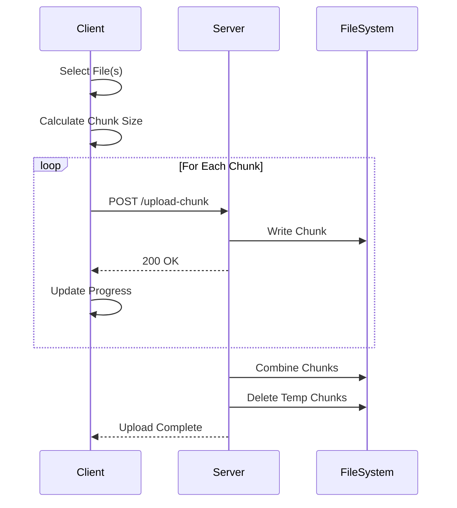

# Chunked File Uploader

A robust Express.js application that handles large file uploads using an intelligent chunking strategy with real-time progress tracking and memory-efficient streaming.


## Features

- ✅ **Intelligent Chunking**: Automatic chunk size calculation based on file size
- ✅ **Multiple File Support**: Upload multiple files sequentially
- ✅ **Real-time Progress**: Live upload progress tracking with progress bar
- ✅ **Memory Efficient**: Streaming implementation to handle large files
- ✅ **Automatic Reassembly**: Server-side chunk combination
- ✅ **Error Handling**: Comprehensive error handling for network issues
- ✅ **Responsive UI**: Clean, simple interface with real-time updates

## Quick Start

### Prerequisites

- Node.js >= 18.0.0
- npm >= 9.0.0

### Installation

```bash
npm install
```

### Running the Server

```bash
npm start
# Server will start on http://localhost:3000
```

For development with auto-restart:

```bash
npm run dev
```

## How It Works

### Architecture



### Chunking Strategy

The application uses an intelligent chunking algorithm that adjusts chunk size based on file size:

| File Size | Chunk Size | Strategy |
|-----------|------------|----------|
| ≤ 100 MB | Full file | Single upload |
| 100-500 MB | 20 MB | Medium chunks |
| 500 MB - 1 GB | 50 MB | Large chunks |
| > 1 GB | 120 MB | Extra large chunks |

This approach optimizes performance while preventing memory issues and timeout errors.

## Project Structure

```
JS_FILEUPLOADER/
├── server.js           # Main server implementation
├── index.html          # Client-side upload interface
├── package.json        # Dependencies and scripts
├── serverv1.js         # Alternative implementation v1
├── serverv2.js         # Alternative implementation v2
├── app.js              # Additional app logic (if needed)
└── README.md           # This file
```

## API Reference

### POST /upload-chunk

Handles individual chunk uploads and reassembles the complete file.

**Request Body (FormData):**
- `chunk` (File): The file chunk binary data
- `chunkIndex` (Number): Zero-based index of current chunk
- `totalChunks` (Number): Total number of chunks for this file
- `fileIdentifier` (String): Unique identifier for the file (name + size)

**Response:**
- `200 OK`: Chunk uploaded successfully
- `500 Internal Server Error`: Error during upload/processing

**Example:**
```javascript
const formData = new FormData();
formData.append('chunk', fileChunk);
formData.append('chunkIndex', 0);
formData.append('totalChunks', 5);
formData.append('fileIdentifier', 'example.pdf-1048576');

fetch('/upload-chunk', {
  method: 'POST',
  body: formData
})
.then(response => response.text())
.then(data => console.log(data));
```

## Configuration

### Change Upload Directory

Modify `server.js` to change where files are stored:

```javascript
const uploadsDir = path.join(__dirname, 'uploads');
// Change to:
const uploadsDir = '/path/to/your/uploads';
```

### Adjust Chunk Size Strategy

Modify the `calculateChunkSize` function in `index.html`:

```javascript
function calculateChunkSize(fileSize) {
  if (fileSize <= 100 * 1024 * 1024) {
    return fileSize; // Files <= 100MB upload whole
  } else if (fileSize <= 500 * 1024 * 1024) {
    return 20 * 1024 * 1024; // 20MB chunks for 100-500MB
  } else {
    return 50 * 1024 * 1024; // 50MB chunks for larger files
  }
}
```

### Change Port

Update the port in `server.js`:

```javascript
app.listen(3000, () => console.log('Server started on http://localhost:3000'));
// Change 3000 to your desired port
```

## Security Considerations

### Important Security Updates Needed

1. **File Type Validation**
```javascript
const fileFilter = (req, file, cb) => {
  // Define allowed file types
  const allowedTypes = /jpeg|jpg|png|gif|pdf|doc|docx/;
  const mimetype = allowedTypes.test(file.mimetype);
  const extname = allowedTypes.test(path.extname(file.originalname).toLowerCase());

  if (mimetype && extname) {
    return cb(null, true);
  }
  cb(new Error('Invalid file type. Only images and documents allowed.'));
};
```

2. **File Size Limits**
```javascript
const upload = multer({
  storage: storage,
  limits: {
    fileSize: 5 * 1024 * 1024 * 1024 // 5GB max
  }
});
```

3. **Path Traversal Prevention**
```javascript
const sanitize = require('sanitize-filename');
const safeFilename = sanitize(fileIdentifier);
```

4. **Rate Limiting**
```javascript
const rateLimit = require('express-rate-limit');
const uploadLimiter = rateLimit({
  windowMs: 15 * 60 * 1000, // 15 minutes
  max: 100 // limit each IP to 100 requests per windowMs
});
app.use('/upload-chunk', uploadLimiter);
```

## Error Handling

The application handles several error scenarios:

### Client-Side Errors

- **Network Timeout**: Displays timeout alert
- **Connection Error**: Alerts user to connection issues
- **Upload Failure**: Shows specific error message

### Server-Side Errors

- **File Write Errors**: Logged and returned to client
- **Chunk Combination Errors**: Proper error handling with cleanup
- **Missing Chunks**: Validation before combination

### Common Error Messages

```
Error: Cannot find module 'express'
Solution: Run npm install

Error: EACCES: permission denied
Solution: Check write permissions on uploads directory
chmod 755 uploads/

Error: Chunk upload failed
Solution: Check network connection and server logs
```

## Performance Optimization

### 1. Parallel Chunk Upload (Advanced)

For faster uploads, modify client to upload chunks in parallel:

```javascript
async function uploadChunksParallel(file, concurrency = 3) {
  const chunks = createChunks(file);
  const results = [];

  for (let i = 0; i < chunks.length; i += concurrency) {
    const batch = chunks.slice(i, i + concurrency);
    const batchResults = await Promise.all(
      batch.map(chunk => uploadChunk(chunk))
    );
    results.push(...batchResults);
  }

  return results;
}
```

### 2. Server Performance

Add compression and optimize chunk writes:

```javascript
const compression = require('compression');
app.use(compression());

// Use streams for better performance
const stream = fs.createWriteStream(chunkPath, { flags: 'a' });
stream.write(chunk.buffer);
stream.end();
```

### 3. Clean Up Old Files

Add automatic cleanup for old uploads:

```javascript
const cron = require('node-cron');

// Run cleanup daily at midnight
cron.schedule('0 0 * * *', () => {
  const now = Date.now();
  const files = fs.readdirSync(uploadsDir);

  files.forEach(file => {
    const filePath = path.join(uploadsDir, file);
    const stats = fs.statSync(filePath);
    const ageInDays = (now - stats.mtimeMs) / (1000 * 60 * 60 * 24);

    if (ageInDays > 7) { // Delete files older than 7 days
      fs.unlinkSync(filePath);
      console.log(`Deleted old file: ${file}`);
    }
  });
});
```

## Testing

### Manual Testing

1. Start the server: `npm start`
2. Open browser to `http://localhost:3000`
3. Select a large file (>100MB recommended)
4. Click "Upload Files"
5. Watch progress bar and console logs

### Automated Testing (Coming Soon)

```bash
npm test
```

## Troubleshooting

### Issue: Files Not Uploading

**Check:**
- Server is running on port 3000
- `uploads` directory exists and has write permissions
- Browser console for errors
- Server console for error logs

### Issue: Slow Upload Speed

**Solutions:**
- Check network connection
- Reduce chunk size for better progress feedback
- Enable parallel chunk uploads
- Check server CPU and disk I/O

### Issue: Upload Freezes

**Solutions:**
- Check browser console for JavaScript errors
- Verify server logs for errors
- Ensure sufficient disk space
- Check for memory issues (use `top` or Task Manager)

### Issue: Chunks Not Combining

**Solutions:**
- Check all chunks were uploaded successfully
- Verify chunk file permissions
- Check server logs for combination errors
- Ensure sufficient disk space for final file

## Development

### Server Versions

The project includes multiple server implementations:

- **server.js**: Main production version with chunk handling
- **serverv1.js**: Simplified version for testing
- **serverv2.js**: Alternative implementation

Choose the version that best fits your needs.

### Adding Features

Example: Add MD5 hash verification

```javascript
const crypto = require('crypto');

function calculateMD5(filePath) {
  return new Promise((resolve, reject) => {
    const hash = crypto.createHash('md5');
    const stream = fs.createReadStream(filePath);

    stream.on('data', data => hash.update(data));
    stream.on('end', () => resolve(hash.digest('hex')));
    stream.on('error', reject);
  });
}

// After combining chunks
const hash = await calculateMD5(finalFilePath);
console.log(`File MD5: ${hash}`);
```

## Screenshots

### Upload Interface


### Upload Progress


## Dependencies

- **[Express.js](https://expressjs.com/)** ^4.21.1 - Web framework
- **[Multer](https://github.com/expressjs/multer)** ^1.4.5-lts.1 - File upload middleware

### Dev Dependencies

- **[Mocha](https://mochajs.org/)** ^10.8.2 - Testing framework
- **[Chai](https://www.chaijs.com/)** ^5.1.2 - Assertion library
- **[Nodemon](https://nodemon.io/)** ^3.1.7 - Development auto-restart

## License

MIT License - see [LICENSE](../LICENSE) file for details.

## Contributing

Contributions welcome! Please read [CONTRIBUTING.md](../CONTRIBUTING.md) first.

## Support

- Open an issue for bugs
- Check existing issues before creating new ones
- Provide detailed reproduction steps

## Roadmap

- [ ] Add resume capability for interrupted uploads
- [ ] Implement file compression before upload
- [ ] Add drag-and-drop interface
- [ ] Support for pause/resume functionality
- [ ] Add upload queue management
- [ ] Implement WebSocket for real-time updates
- [ ] Add user authentication
- [ ] Create upload history/dashboard

---

**Note**: This application is designed for development and testing. For production use, implement additional security measures, authentication, and error handling.
