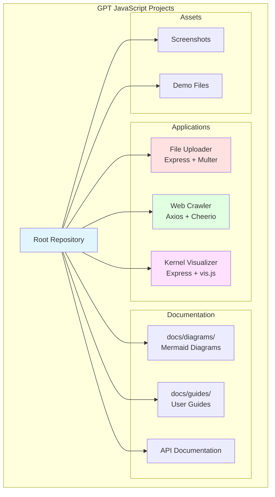
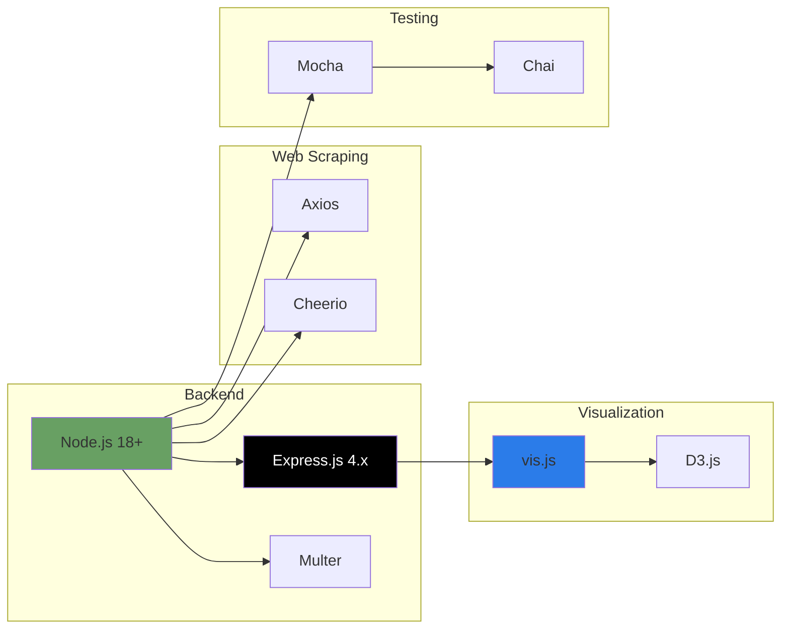
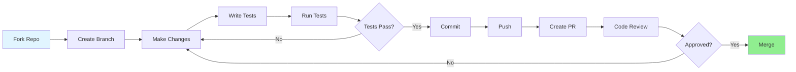

# GPT JavaScript Projects Collection

[](https://opensource.org/licenses/MIT)
[](https://nodejs.org/)
[](https://www.ecma-international.org/ecma-262/)
[](CONTRIBUTING.md)
[](https://github.com/danindiana/Gpt_JavaScript/graphs/commit-activity)

A curated collection of AI-assisted JavaScript/Node.js projects demonstrating practical implementations of web crawling, file uploading, and system visualization.

## 📋 Table of Contents

- [Overview](#overview)
- [Projects](#projects)
- [Repository Architecture](#repository-architecture)
- [Getting Started](#getting-started)
- [Prerequisites](#prerequisites)
- [Installation](#installation)
- [Documentation](#documentation)
- [Contributing](#contributing)
- [License](#license)

## 🎯 Overview

This repository contains several standalone JavaScript projects created with AI assistance (GPT/LLM), each demonstrating different aspects of modern web development and system administration:

- **File Upload System**: Chunked file upload with progress tracking
- **Web Crawler**: Recursive web scraping with content extraction
- **Linux Kernel Visualizer**: Interactive visualization of kernel module dependencies

## 🚀 Projects

### 1. File Uploader (JS_FILEUPLOADER)

A robust Express.js application that handles large file uploads using chunking strategy.

**Features:**
- ✅ Chunked file upload for large files
- ✅ Real-time upload progress tracking
- ✅ Memory-efficient streaming
- ✅ Automatic chunk reassembly

**Quick Start:**
```bash
cd JS_FILEUPLOADER
npm install
npm start
# Visit http://localhost:3000
```

[📖 Full Documentation](./JS_FILEUPLOADER/README.md)

---

### 2. Web Crawler (web-crawler)

An intelligent web crawler that recursively scrapes websites and extracts text content.

**Features:**
- ✅ Recursive URL crawling
- ✅ Automatic content extraction
- ✅ Cache management with file size limits
- ✅ Sanitized output filenames

**Quick Start:**
```bash
cd web-crawler
npm install
node crawler.js
```

[📖 Full Documentation](./web-crawler/README.md)

---

### 3. Linux Kernel Module Visualizer

Interactive visualization of Linux kernel modules and their dependencies using Node.js and vis.js.

**Features:**
- ✅ Real-time kernel module detection
- ✅ Interactive dependency graph
- ✅ Web-based visualization
- ✅ RESTful API for module data

**Quick Start:**
```bash
cd linux-kernel-module-visualizer
npm install
npm start
# Visit http://localhost:3000
```

[📖 Full Documentation](./linux-kernel-module-visualizer/README.md)

---

## 🏗️ Repository Architecture



### Project Structure

```
Gpt_JavaScript/
├── JS_FILEUPLOADER/          # Chunked file upload system
│   ├── server.js             # Main server implementation
│   ├── index.html            # Client interface
│   ├── package.json          # Dependencies
│   └── README.md             # Project documentation
│
├── web-crawler/              # Web scraping tool
│   ├── crawler.js            # Main crawler logic
│   ├── package.json          # Dependencies
│   └── README.md             # Project documentation
│
├── linux-kernel-module-visualizer/
│   ├── server/               # Backend API
│   │   └── server.js
│   ├── client/               # Frontend visualization
│   │   └── index.html
│   ├── package.json
│   └── README.md
│
├── docs/                     # Comprehensive documentation
│   ├── diagrams/             # Mermaid diagrams
│   ├── guides/               # User guides
│   └── api/                  # API documentation
│
├── assets/                   # Media files
│   └── screenshots/          # Application screenshots
│
├── .gitignore               # Git ignore rules
├── CONTRIBUTING.md          # Contribution guidelines
├── CODE_OF_CONDUCT.md       # Code of conduct
└── README.md                # This file
```

## 📊 Technology Stack



## 🛠️ Getting Started

### Prerequisites

Before running any project, ensure you have:

- **Node.js** >= 18.0.0 ([Download](https://nodejs.org/))
- **npm** >= 9.0.0 (comes with Node.js)
- **Git** ([Download](https://git-scm.com/))

### Installation

1. **Clone the repository**
   ```bash
   git clone https://github.com/danindiana/Gpt_JavaScript.git
   cd Gpt_JavaScript
   ```

2. **Choose a project and navigate to its directory**
   ```bash
   cd JS_FILEUPLOADER  # or web-crawler, or linux-kernel-module-visualizer
   ```

3. **Install dependencies**
   ```bash
   npm install
   ```

4. **Run the project**
   ```bash
   npm start
   ```

## 📚 Documentation

Comprehensive documentation is available in the `docs/` directory:

- **[Getting Started Guide](./docs/guides/getting-started.md)** - Quick introduction to all projects
- **[API Reference](./docs/api/README.md)** - Detailed API documentation
- **[Architecture Diagrams](./docs/diagrams/README.md)** - Visual system architecture
- **[Troubleshooting](./docs/guides/troubleshooting.md)** - Common issues and solutions

### Mermaid Diagrams

The repository includes several architectural and workflow diagrams:

- [GPU C++ Library Workflow](./docs/diagrams/gpu_cpp.md)
- [React Installation Process](./docs/diagrams/react_install.md)
- [Browser Extension Security](./docs/diagrams/universe_chainer.md)
- [Workflow Management](./docs/diagrams/use_work_journal.md)

## 🤝 Contributing

We welcome contributions! Please see our [Contributing Guidelines](CONTRIBUTING.md) for details on:

- Code of Conduct
- Development process
- Submitting pull requests
- Reporting bugs
- Suggesting enhancements

### Development Workflow



## 🔒 Security

Security is a priority. If you discover a security vulnerability:

1. **DO NOT** open a public issue
2. Email details to the repository maintainers
3. Wait for a response before disclosing publicly

See [SECURITY.md](SECURITY.md) for more details.

## 📈 Project Status

| Project | Status | Version | Last Updated |
|---------|--------|---------|--------------|
| File Uploader | ✅ Active | 2.0.0 | 2024-11 |
| Web Crawler | ✅ Active | 2.0.0 | 2024-11 |
| Kernel Visualizer | ✅ Active | 1.0.0 | 2024-11 |

## 🗺️ Roadmap

- [ ] Add Docker support for all projects
- [ ] Implement CI/CD with GitHub Actions
- [ ] Add comprehensive test coverage
- [ ] Create live demo deployments
- [ ] Add WebSocket support for real-time updates
- [ ] Implement authentication and authorization
- [ ] Add database integration options
- [ ] Create CLI tools for each project

## 📝 License

This project is licensed under the MIT License - see the [LICENSE](LICENSE) file for details.

## 🙏 Acknowledgments

- Created with assistance from GPT/LLM AI models
- Built on top of excellent open-source libraries
- Inspired by the Node.js and JavaScript community

## 📞 Contact & Support

- **Issues**: [GitHub Issues](https://github.com/danindiana/Gpt_JavaScript/issues)
- **Discussions**: [GitHub Discussions](https://github.com/danindiana/Gpt_JavaScript/discussions)
- **Wiki**: [Project Wiki](https://github.com/danindiana/Gpt_JavaScript/wiki)

---

<div align="center">

**[⬆ back to top](#gpt-javascript-projects-collection)**

Made with ❤️ using Node.js and AI assistance

</div>
