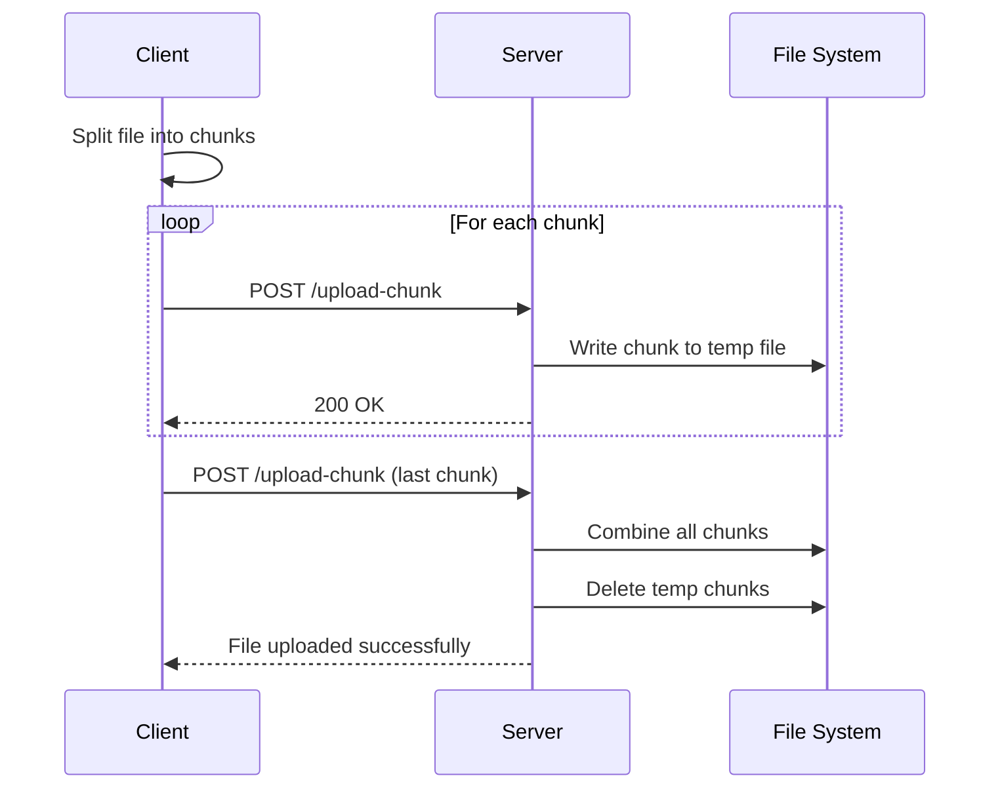

# API Documentation

Comprehensive API reference for all projects in the GPT JavaScript Collection.

## Overview

This repository contains three main projects, two of which expose RESTful APIs:

| Project | API Available | Base URL |
|---------|---------------|----------|
| File Uploader | ✅ Yes | `http://localhost:3000` |
| Web Crawler | ❌ No (CLI only) | N/A |
| Kernel Visualizer | ✅ Yes | `http://localhost:3000` |

---

## File Uploader API

The File Uploader provides a single endpoint for chunked file uploads.

### Base URL

```
http://localhost:3000
```

### Endpoints

#### POST /upload-chunk

Upload a file chunk.

**Request Format**: `multipart/form-data`

**Parameters**:

| Name | Type | Required | Description |
|------|------|----------|-------------|
| `chunk` | File | Yes | Binary chunk data |
| `chunkIndex` | Number | Yes | Zero-based chunk index |
| `totalChunks` | Number | Yes | Total number of chunks |
| `fileIdentifier` | String | Yes | Unique file identifier (name + size) |

**Response**: `200 OK`

```
Chunk uploaded successfully!
```

or

```
File uploaded and combined successfully!
```

**Error Responses**:

- `500 Internal Server Error`: Upload or combination failed

**Example using curl**:

```bash
# Upload a single chunk
curl -X POST http://localhost:3000/upload-chunk \
  -F "chunk=@file-part-0" \
  -F "chunkIndex=0" \
  -F "totalChunks=3" \
  -F "fileIdentifier=example.pdf-1048576"
```

**Example using JavaScript**:

```javascript
const formData = new FormData();
formData.append('chunk', fileChunk);
formData.append('chunkIndex', 0);
formData.append('totalChunks', 5);
formData.append('fileIdentifier', 'document.pdf-5242880');

fetch('http://localhost:3000/upload-chunk', {
  method: 'POST',
  body: formData
})
.then(response => response.text())
.then(data => console.log(data))
.catch(error => console.error('Error:', error));
```

**Example using axios**:

```javascript
const axios = require('axios');
const FormData = require('form-data');
const fs = require('fs');

const formData = new FormData();
formData.append('chunk', fs.createReadStream('chunk-0'));
formData.append('chunkIndex', 0);
formData.append('totalChunks', 3);
formData.append('fileIdentifier', 'file.zip-1024000');

axios.post('http://localhost:3000/upload-chunk', formData, {
  headers: formData.getHeaders()
})
.then(response => console.log(response.data))
.catch(error => console.error(error));
```

### Chunking Strategy

Files are automatically chunked based on size:

| File Size | Chunk Size | Method |
|-----------|------------|--------|
| ≤ 100 MB | Full file | Single upload |
| 100-500 MB | 20 MB | Multiple chunks |
| 500 MB - 1 GB | 50 MB | Multiple chunks |
| > 1 GB | 120 MB | Multiple chunks |

### Complete Upload Flow



---

## Kernel Visualizer API

The Kernel Visualizer exposes endpoints for accessing kernel module information.

### Base URL

```
http://localhost:3000
```

### Endpoints

#### GET /api/modules

Retrieve all kernel modules and their dependencies.

**Parameters**: None

**Response**: `200 OK`

```json
{
  "success": true,
  "count": 156,
  "data": [
    {
      "name": "ip_tables",
      "size": 32768,
      "used": 1,
      "usedBy": ["iptable_filter", "iptable_nat"]
    },
    {
      "name": "ext4",
      "size": 786432,
      "used": 3,
      "usedBy": []
    }
  ],
  "timestamp": "2024-11-18T22:30:00.000Z"
}
```

**Error Response**: `500 Internal Server Error`

```json
{
  "success": false,
  "error": "Failed to retrieve kernel modules",
  "timestamp": "2024-11-18T22:30:00.000Z"
}
```

**Example using curl**:

```bash
curl http://localhost:3000/api/modules | jq
```

**Example using fetch**:

```javascript
fetch('http://localhost:3000/api/modules')
  .then(response => response.json())
  .then(data => {
    console.log(`Total modules: ${data.count}`);
    data.data.forEach(module => {
      console.log(`${module.name}: ${module.usedBy.length} dependencies`);
    });
  });
```

**Example using axios**:

```javascript
const axios = require('axios');

async function getModules() {
  try {
    const response = await axios.get('http://localhost:3000/api/modules');
    return response.data;
  } catch (error) {
    console.error('Error fetching modules:', error.message);
  }
}

getModules().then(data => {
  if (data && data.success) {
    console.log(`Found ${data.count} modules`);
  }
});
```

**Python Example**:

```python
import requests
import json

response = requests.get('http://localhost:3000/api/modules')
data = response.json()

if data['success']:
    print(f"Total modules: {data['count']}")
    for module in data['data']:
        deps = len(module['usedBy'])
        print(f"{module['name']}: {deps} dependencies")
```

#### GET /api/health

Health check endpoint for monitoring.

**Parameters**: None

**Response**: `200 OK`

```json
{
  "status": "healthy",
  "uptime": 1234.56,
  "timestamp": "2024-11-18T22:30:00.000Z"
}
```

**Example**:

```bash
curl http://localhost:3000/api/health
```

### Data Model

#### Module Object

```typescript
interface Module {
  name: string;        // Module name
  size: number;        // Size in bytes
  used: number;        // Usage count
  usedBy: string[];    // Array of dependent module names
}
```

**Example**:

```json
{
  "name": "nvidia",
  "size": 14417920,
  "used": 45,
  "usedBy": ["nvidia_uvm", "nvidia_drm", "nvidia_modeset"]
}
```

### Filtering and Querying

While the API doesn't support server-side filtering, you can filter client-side:

```javascript
// Find modules with dependencies
const modulesWithDeps = data.data.filter(m => m.usedBy.length > 0);

// Find largest modules
const largest = data.data.sort((a, b) => b.size - a.size).slice(0, 10);

// Search by name
const searchResults = data.data.filter(m =>
  m.name.toLowerCase().includes('nvidia')
);

// Get total size of all modules
const totalSize = data.data.reduce((sum, m) => sum + m.size, 0);
```

---

## Web Crawler

The Web Crawler is a command-line tool without an API. However, you can integrate it into your applications:

### Programmatic Usage

```javascript
const { execSync } = require('child_process');

function crawlWebsite(url) {
  try {
    // Run crawler
    const output = execSync(`echo "${url}" | node crawler.js`, {
      cwd: '/path/to/web-crawler',
      encoding: 'utf8'
    });

    console.log(output);
  } catch (error) {
    console.error('Crawl failed:', error.message);
  }
}

crawlWebsite('https://example.com');
```

### Future API Plans

A RESTful API for the web crawler is planned:

```javascript
// Proposed API endpoints (not yet implemented)

// Start a crawl
POST /api/crawl
{
  "url": "https://example.com",
  "maxDepth": 5,
  "maxPages": 100
}

// Get crawl status
GET /api/crawl/:id

// Get crawl results
GET /api/crawl/:id/results

// Stop a crawl
DELETE /api/crawl/:id
```

---

## Common Patterns

### Error Handling

All APIs use standard HTTP status codes:

| Code | Meaning | When Used |
|------|---------|-----------|
| 200 | OK | Successful request |
| 400 | Bad Request | Invalid parameters |
| 404 | Not Found | Endpoint doesn't exist |
| 500 | Internal Server Error | Server-side error |

**Example error handling**:

```javascript
async function safeApiCall(url) {
  try {
    const response = await fetch(url);

    if (!response.ok) {
      throw new Error(`HTTP ${response.status}: ${response.statusText}`);
    }

    const data = await response.json();

    if (!data.success) {
      throw new Error(data.error || 'API call failed');
    }

    return data;
  } catch (error) {
    console.error('API Error:', error.message);
    return null;
  }
}
```

### Rate Limiting

Currently, no rate limiting is implemented. For production use, add rate limiting:

```javascript
const rateLimit = require('express-rate-limit');

const limiter = rateLimit({
  windowMs: 15 * 60 * 1000, // 15 minutes
  max: 100, // limit each IP to 100 requests per windowMs
  message: 'Too many requests, please try again later.'
});

app.use('/api/', limiter);
```

### CORS Configuration

For cross-origin requests:

```javascript
const cors = require('cors');

// Allow all origins (development only)
app.use(cors());

// Or configure specific origins
app.use(cors({
  origin: ['http://localhost:3000', 'https://example.com'],
  credentials: true
}));
```

### Authentication

No authentication is currently implemented. For production:

```javascript
// Basic Auth example
const basicAuth = require('express-basic-auth');

app.use('/api', basicAuth({
  users: { 'admin': 'supersecret' },
  challenge: true
}));

// Or JWT
const jwt = require('jsonwebtoken');

function authenticateToken(req, res, next) {
  const token = req.headers['authorization'];
  if (!token) return res.sendStatus(401);

  jwt.verify(token, process.env.JWT_SECRET, (err, user) => {
    if (err) return res.sendStatus(403);
    req.user = user;
    next();
  });
}

app.use('/api', authenticateToken);
```

---

## Testing APIs

### Using curl

```bash
# GET request
curl http://localhost:3000/api/modules

# GET with headers
curl -H "Accept: application/json" http://localhost:3000/api/health

# POST request
curl -X POST http://localhost:3000/upload-chunk \
  -F "chunk=@file.txt" \
  -F "chunkIndex=0" \
  -F "totalChunks=1" \
  -F "fileIdentifier=file.txt-1024"

# Save response to file
curl http://localhost:3000/api/modules > modules.json
```

### Using Postman

1. Create new request
2. Set method (GET/POST)
3. Enter URL
4. For file upload:
   - Select Body → form-data
   - Add parameters
   - Select File type for `chunk`
5. Click Send

### Using HTTPie

```bash
# Install HTTPie
pip install httpie

# GET request
http GET http://localhost:3000/api/modules

# POST request
http POST http://localhost:3000/upload-chunk \
  chunk@file.txt \
  chunkIndex=0 \
  totalChunks=1 \
  fileIdentifier="file.txt-1024"
```

---

## API Versioning

Currently, APIs are unversioned. Future versions may include:

```
http://localhost:3000/api/v1/modules
http://localhost:3000/api/v2/modules
```

---

## Contributing

To add new API endpoints:

1. Add route handler in appropriate server file
2. Document endpoint in this README
3. Add examples in multiple languages
4. Include error handling examples
5. Update integration tests

---

## Additional Resources

- [Express.js Routing](https://expressjs.com/en/guide/routing.html)
- [REST API Best Practices](https://restfulapi.net/)
- [HTTP Status Codes](https://httpstatuses.com/)
- [API Design Guide](https://cloud.google.com/apis/design)

---

**Need help?** Check the [troubleshooting guide](../guides/troubleshooting.md) or open an issue.
