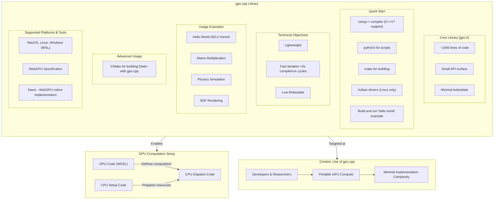

```mermaid
flowchart TB
subgraph gpu_cpp ["gpu.cpp Library"]
direction TB
subgraph core_lib ["Core Library (gpu.h)"]
core_impl["~1000 lines of code"]
core_api["Small API surface"]
core_min_boilerplate["Minimal boilerplate"]
end

subgraph quick_start ["Quick Start"]
clang["clang++ compiler (C++17 support)"]
python["python3 for scripts"]
make_tool["make for building"]
vulkan["Vulkan drivers (Linux only)"]
build_run["Build and run 'hello world' example"]
end

subgraph technical_objectives ["Technical Objectives"]
lightweight["Lightweight"]
fast_iteration["Fast Iteration <5s compile/run cycles"]
low_boilerplate["Low Boilerplate"]
end

subgraph usage_examples ["Usage Examples"]
hello_world["Hello World GELU Kernel"]
matmul["Matrix Multiplication"]
physics_sim["Physics Simulation"]
sdf_rendering["SDF Rendering"]
end

subgraph advanced_usage ["Advanced Usage"]
cmake_build["CMake for building Dawn with gpu.cpp"]
end

subgraph supported_platforms ["Supported Platforms & Tools"]
platforms["MacOS, Linux, Windows (WSL)"]
webgpu_spec["WebGPU Specification"]
dawn_lib["Dawn - WebGPU native implementation"]
end
end

subgraph gpu_computation ["GPU Computation Setup"]
direction LR
gpu_code["GPU Code (WGSL)"]
cpu_setup["CPU Setup Code"]
cpu_dispatch["CPU Dispatch Code"]

gpu_code -->|Defines computation| cpu_dispatch
cpu_setup -->|Prepares resources| cpu_dispatch
end

subgraph context ["Context: Use of gpu.cpp"]
developers_researchers["Developers & Researchers"]
portable_gpu_compute["Portable GPU Compute"]
minimal_complexity["Minimal Implementation Complexity"]

developers_researchers --> portable_gpu_compute
portable_gpu_compute --> minimal_complexity
end

gpu_cpp -->|Enables| gpu_computation
gpu_cpp -->|Targeted at| context
```
