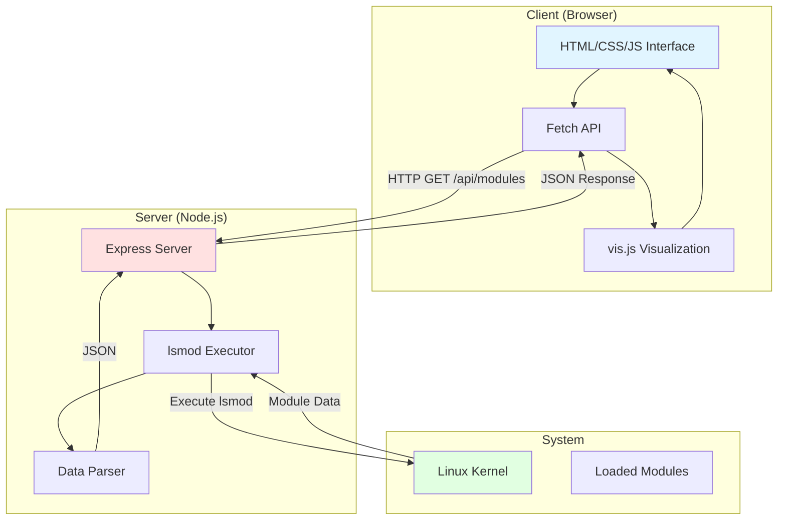

# Linux Kernel Module Visualizer

Interactive web-based visualization of Linux kernel modules and their dependencies using Node.js, Express, and vis.js.

## Features

- ✅ **Real-time Module Detection**: Automatically detects all loaded kernel modules using `lsmod`
- ✅ **Interactive Graph**: Drag, zoom, and explore module dependencies
- ✅ **Dependency Visualization**: Clear visual representation of module relationships
- ✅ **Module Details**: Click on nodes to view detailed module information
- ✅ **Multiple Layouts**: Switch between physics-based and hierarchical layouts
- ✅ **Responsive Design**: Works on desktop and mobile devices
- ✅ **RESTful API**: Programmatic access to module data

## Architecture



## Prerequisites

- **Operating System**: Linux (any distribution)
- **Node.js**: >= 18.0.0
- **npm**: >= 9.0.0
- **Permissions**: Read access to kernel modules (typically available to all users)

## Installation

1. **Navigate to the project directory**
   ```bash
   cd linux-kernel-module-visualizer
   ```

2. **Install dependencies**
   ```bash
   npm install
   ```

3. **Start the server**
   ```bash
   npm start
   ```

4. **Open your browser**
   ```
   http://localhost:3000
   ```

## Usage

### Web Interface

1. **View Modules**: The graph automatically loads all kernel modules on page load
2. **Explore Dependencies**:
   - Hover over nodes to see tooltips
   - Click nodes to view detailed information
   - Drag nodes to rearrange the layout
3. **Controls**:
   - **🔄 Refresh Data**: Reload module data from the system
   - **📐 Fit to Screen**: Center and scale the graph
   - **🌳 Hierarchical Layout**: Toggle between physics and hierarchical layouts
   - **⚡ Toggle Physics**: Enable/disable physics simulation

### API Endpoints

#### GET /api/modules

Returns all kernel modules with their dependencies.

**Response:**
```json
{
  "success": true,
  "count": 156,
  "data": [
    {
      "name": "ip_tables",
      "size": 32768,
      "used": 1,
      "usedBy": ["iptable_filter"]
    }
  ],
  "timestamp": "2024-11-18T22:30:00.000Z"
}
```

**Example:**
```bash
curl http://localhost:3000/api/modules | jq
```

#### GET /api/health

Health check endpoint.

**Response:**
```json
{
  "status": "healthy",
  "uptime": 1234.56,
  "timestamp": "2024-11-18T22:30:00.000Z"
}
```

## Project Structure

```
linux-kernel-module-visualizer/
├── server/
│   └── server.js              # Express server and API
├── client/
│   └── index.html             # Web interface with vis.js
├── package.json               # Dependencies and scripts
├── README.md                  # This file
└── readme-old.md             # Original documentation
```

## How It Works

### Data Flow

1. **Server Startup**: Express server starts and serves static files
2. **Client Request**: Browser requests `/api/modules`
3. **Execute lsmod**: Server runs `lsmod` command
4. **Parse Output**: Server parses command output into structured data
5. **Return JSON**: Server sends JSON response to client
6. **Visualize**: Client renders interactive graph using vis.js

### Module Data Structure

Each module object contains:
- `name`: Module name
- `size`: Size in bytes
- `used`: Number of times the module is used
- `usedBy`: Array of modules that depend on this module

### Graph Visualization

- **Nodes**: Each module is represented as a node
- **Edges**: Dependencies are shown as directed arrows
- **Colors**:
  - 🟢 Green: Modules with dependencies
  - 🔵 Blue: Standalone modules
  - 🟠 Orange: Dependency modules
- **Size**: Node size reflects module size

## Configuration

### Change Port

Edit `server/server.js`:
```javascript
const port = process.env.PORT || 3000;
```

Or set environment variable:
```bash
PORT=8080 npm start
```

### Customize Graph Layout

Edit `client/index.html`, modify the `options` object:

```javascript
const options = {
    physics: {
        barnesHut: {
            gravitationalConstant: -30000,  // Adjust force
            springConstant: 0.001,          // Adjust spring
            springLength: 200                // Adjust distance
        }
    }
};
```

## Development

### Running in Development Mode

With auto-restart on file changes:

```bash
npm run dev
```

### Adding New Features

#### Example: Add Module Search

1. **Update server** to add search endpoint:
```javascript
app.get('/api/modules/search/:name', async (req, res) => {
    const modules = await getKernelModules();
    const filtered = modules.filter(m =>
        m.name.includes(req.params.name)
    );
    res.json({ success: true, data: filtered });
});
```

2. **Update client** to add search UI:
```html
<input type="text" id="search" placeholder="Search modules...">
<button onclick="searchModules()">Search</button>
```

## Troubleshooting

### Common Issues

**Issue: "lsmod: command not found"**
```bash
# Solution: Install kmod package
sudo apt-get install kmod  # Debian/Ubuntu
sudo yum install kmod      # RHEL/CentOS
```

**Issue: "Cannot find module 'express'"**
```bash
# Solution: Install dependencies
npm install
```

**Issue: No modules displayed**
- Check browser console for errors
- Verify lsmod works: `lsmod` in terminal
- Check server logs for errors
- Ensure you're on a Linux system

**Issue: Graph is too cluttered**
- Use hierarchical layout button
- Zoom out using mouse wheel
- Click "Fit to Screen" button
- Disable physics for static layout

## Performance Considerations

### Large Number of Modules

For systems with 200+ modules:

1. **Reduce Physics Iterations**:
```javascript
physics: {
    stabilization: {
        iterations: 100  // Reduce from 200
    }
}
```

2. **Limit Initial Data**:
```javascript
// Only load top modules initially
const topModules = modules.slice(0, 50);
```

3. **Use Hierarchical Layout**:
- Better performance for large graphs
- Cleaner visual representation

## Security Considerations

### Important Notes

1. **Read-Only Operations**: The tool only reads module information, never modifies
2. **No Root Required**: Works with standard user permissions
3. **Local Access**: Designed for localhost only by default
4. **No Authentication**: Add authentication for public deployment

### Securing for Production

```javascript
// Add basic authentication
const basicAuth = require('express-basic-auth');

app.use(basicAuth({
    users: { 'admin': 'supersecret' },
    challenge: true
}));
```

## API Integration Examples

### Python

```python
import requests

response = requests.get('http://localhost:3000/api/modules')
data = response.json()

for module in data['data']:
    print(f"{module['name']}: {len(module['usedBy'])} dependencies")
```

### Bash

```bash
#!/bin/bash
curl -s http://localhost:3000/api/modules | \
    jq -r '.data[] | "\(.name) (\(.size/1024 | floor)KB)"'
```

### JavaScript/Node.js

```javascript
const axios = require('axios');

async function getModules() {
    const response = await axios.get('http://localhost:3000/api/modules');
    return response.data.data;
}

getModules().then(modules => {
    console.log(`Total modules: ${modules.length}`);
});
```

## Deployment

### Using PM2

```bash
# Install PM2
npm install -g pm2

# Start application
pm2 start server/server.js --name kernel-viz

# View logs
pm2 logs kernel-viz

# Stop application
pm2 stop kernel-viz
```

### Using Docker

Create `Dockerfile`:
```dockerfile
FROM node:18-alpine

WORKDIR /app
COPY package*.json ./
RUN npm install --production
COPY . .

EXPOSE 3000
CMD ["npm", "start"]
```

Build and run:
```bash
docker build -t kernel-visualizer .
docker run -p 3000:3000 kernel-visualizer
```

### Reverse Proxy with Nginx

```nginx
server {
    listen 80;
    server_name kernel-viz.example.com;

    location / {
        proxy_pass http://localhost:3000;
        proxy_http_version 1.1;
        proxy_set_header Upgrade $http_upgrade;
        proxy_set_header Connection 'upgrade';
        proxy_set_header Host $host;
        proxy_cache_bypass $http_upgrade;
    }
}
```

## Browser Compatibility

- ✅ Chrome/Edge 90+
- ✅ Firefox 88+
- ✅ Safari 14+
- ✅ Opera 76+

## Dependencies

### Production
- **[Express.js](https://expressjs.com/)** ^4.21.1 - Web framework
- **[vis.js](https://visjs.org/)** - Graph visualization (loaded from CDN)

### Development
- **[Nodemon](https://nodemon.io/)** ^3.1.7 - Development auto-reload

## Contributing

Contributions welcome! Please see [CONTRIBUTING.md](../CONTRIBUTING.md) for guidelines.

### Ideas for Contribution

- [ ] Add module dependency depth visualization
- [ ] Implement module search and filtering
- [ ] Add export to image functionality
- [ ] Create module loading/unloading history
- [ ] Add comparison between system states
- [ ] Implement real-time module monitoring

## License

MIT License - see [LICENSE](../LICENSE) file for details.

## Acknowledgments

- Built with [vis.js](https://visjs.org/) for graph visualization
- Inspired by tools like `lsmod` and `modinfo`
- Created as part of the GPT JavaScript Projects Collection

## Support

- **Issues**: [GitHub Issues](https://github.com/danindiana/Gpt_JavaScript/issues)
- **Documentation**: Check `readme-old.md` for original documentation

## Changelog

### Version 1.0.0 (2024-11)
- Initial release
- Interactive graph visualization
- RESTful API for module data
- Multiple layout options
- Responsive design
- Module detail view

---

**Note**: This tool is designed for Linux systems only. It requires the `lsmod` command to be available.
