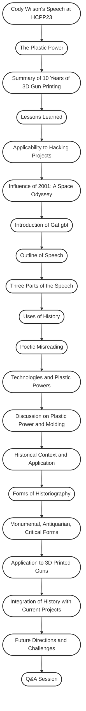

```mermaid
flowchart TD
A([Cody Wilson's Speech at HCPP23]) --> B([The Plastic Power])
B --> C([Summary of 10 Years of 3D Gun Printing])
C --> D([Lessons Learned])
D --> E([Applicability to Hacking Projects])
E --> F([Influence of 2001: A Space Odyssey])
F --> G([Introduction of Gat gbt])
G --> H([Outline of Speech])
H --> I([Three Parts of the Speech])
I --> J([Uses of History])
J --> K([Poetic Misreading])
K --> L([Technologies and Plastic Powers])
L --> M([Discussion on Plastic Power and Molding])
M --> N([Historical Context and Application])
N --> O([Forms of Historiography])
O --> P([Monumental, Antiquarian, Critical Forms])
P --> Q([Application to 3D Printed Guns])
Q --> R([Integration of History with Current Projects])
R --> S([Future Directions and Challenges])
S --> T([Q&A Session])

classDef default fill:#fff,stroke:#333,stroke-width:2px;
class A,B,C,D,E,F,G,H,I,J,K,L,M,N,O,P,Q,R,S,T default;
```
