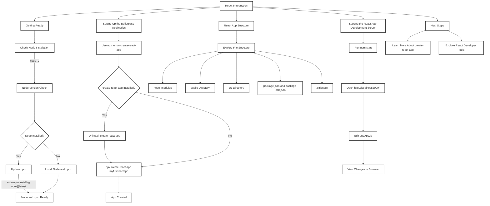

```mermaid
flowchart TD
A[React Introduction] --> B[Getting Ready]
A --> C[Setting Up the Boilerplate Application]
A --> D[React App Structure]
A --> E[Starting the React App Development Server]
A --> F[Next Steps]

B --> B1[Check Node Installation]
B1 -->|node -v| B2[Node Version Check]
B2 --> B3{Node Installed?}
B3 -->|Yes| B4[Update npm]
B3 -->|No| B5[Install Node and npm]
B4 -->|sudo npm install -g npm@latest| B6[Node and npm Ready]
B5 --> B6

C --> C1[Use npx to run create-react-app]
C1 --> C2{create-react-app Installed?}
C2 -->|Yes| C3[Uninstall create-react-app]
C3 --> C4[npx create-react-app myfirstreactapp]
C2 -->|No| C4
C4 --> C5[App Created]

D --> D1[Explore File Structure]
D1 --> D2[node_modules]
D1 --> D3[public Directory]
D1 --> D4[src Directory]
D1 --> D5[package.json and package-lock.json]
D1 --> D6[.gitignore]

E --> E1[Run npm start]
E1 --> E2[Open http://localhost:3000/]
E2 --> E3[Edit src/App.js]
E3 --> E4[View Changes in Browser]

F --> F1[Learn More About create-react-app]
F --> F2[Explore React Developer Tools]

classDef default fill:#fff,stroke:#333,stroke-width:2px;
```
