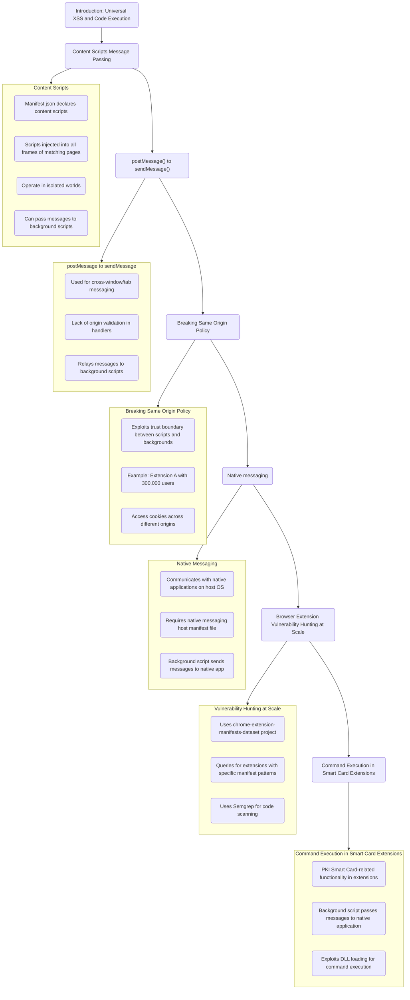

```mermaid
flowchart TD
intro("Introduction: Universal XSS and Code Execution")
contentScripts("Content Scripts Message Passing")
postMessageToSendMessage("postMessage() to sendMessage()")
breakingSOP("Breaking Same Origin Policy")
nativeMessaging("Native messaging")
vulnerabilityHunting("Browser Extension Vulnerability Hunting at Scale")
commandExecution("Command Execution in Smart Card Extensions")

intro --> contentScripts
contentScripts --> postMessageToSendMessage
postMessageToSendMessage --> breakingSOP
breakingSOP --> nativeMessaging
nativeMessaging --> vulnerabilityHunting
vulnerabilityHunting --> commandExecution

subgraph contentScriptsDetails ["Content Scripts"]
csManifest("Manifest.json declares content scripts")
csInjection("Scripts injected into all frames of matching pages")
csIsolation("Operate in isolated worlds")
csMessagePassing("Can pass messages to background scripts")
end

subgraph postMessageDetails ["postMessage to sendMessage"]
pmUsage("Used for cross-window/tab messaging")
pmVulnerability("Lack of origin validation in handlers")
pmToSm("Relays messages to background scripts")
end

subgraph breakingSOPDetails ["Breaking Same Origin Policy"]
sopTrustBoundary("Exploits trust boundary between scripts and backgrounds")
sopExample("Example: Extension A with 300,000 users")
sopCookieAccess("Access cookies across different origins")
end

subgraph nativeMessagingDetails ["Native Messaging"]
nmCapability("Communicates with native applications on host OS")
nmManifest("Requires native messaging host manifest file")
nmMessageHandling("Background script sends messages to native app")
end

subgraph vulnerabilityHuntingDetails ["Vulnerability Hunting at Scale"]
vhDataset("Uses chrome-extension-manifests-dataset project")
vhQuerying("Queries for extensions with specific manifest patterns")
vhSemgrep("Uses Semgrep for code scanning")
end

subgraph commandExecutionDetails ["Command Execution in Smart Card Extensions"]
cePKI("PKI Smart Card-related functionality in extensions")
ceMessageHandling("Background script passes messages to native application")
ceDLLLoading("Exploits DLL loading for command execution")
end

contentScripts --> contentScriptsDetails
postMessageToSendMessage --> postMessageDetails
breakingSOP --> breakingSOPDetails
nativeMessaging --> nativeMessagingDetails
vulnerabilityHunting --> vulnerabilityHuntingDetails
commandExecution --> commandExecutionDetails
```
