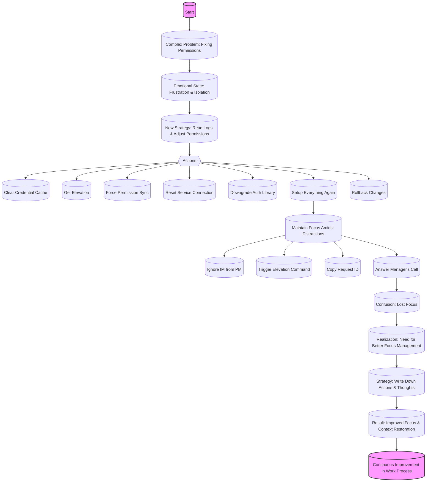

```mermaid
flowchart TB
Start[("Start")] --> Problem[("Complex Problem: Fixing Permissions")]
Problem --> EmotionalState[("Emotional State: Frustration & Isolation")]
EmotionalState --> Strategy[("New Strategy: Read Logs & Adjust Permissions")]
Strategy --> Actions{{"Actions"}}
Actions --> ClearCache[("Clear Credential Cache")]
Actions --> GetElevation[("Get Elevation")]
Actions --> ForceSync[("Force Permission Sync")]
Actions --> ResetConnection[("Reset Service Connection")]
Actions --> DowngradeLib[("Downgrade Auth Library")]
Actions --> SetupEverything[("Setup Everything Again")]
Actions --> Rollback[("Rollback Changes")]
SetupEverything --> Focus[("Maintain Focus Amidst Distractions")]
Focus --> IgnoreIM[("Ignore IM from PM")]
Focus --> TriggerElevation[("Trigger Elevation Command")]
Focus --> CopyID[("Copy Request ID")]
Focus --> ManagerCall[("Answer Manager's Call")]
ManagerCall --> Confusion[("Confusion: Lost Focus")]
Confusion --> Realization[("Realization: Need for Better Focus Management")]
Realization --> WritingStrategy[("Strategy: Write Down Actions & Thoughts")]
WritingStrategy --> ImprovedFocus[("Result: Improved Focus & Context Restoration")]
ImprovedFocus --> ContinuousImprovement[("Continuous Improvement in Work Process")]

classDef startend fill:#f9f,stroke:#333,stroke-width:2px;
class Start,ContinuousImprovement startend;
```
