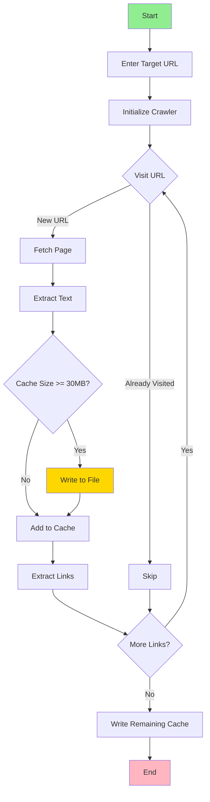

# Web Crawler

An intelligent recursive web crawler that extracts text content from websites and manages output with configurable cache limits.

## Features

- ✅ Recursive URL crawling with visited URL tracking
- ✅ Automatic text extraction from HTML
- ✅ Configurable cache size management (default: 30MB)
- ✅ Automatic file output with timestamped filenames
- ✅ Sanitized filename generation
- ✅ Handles relative and absolute URLs
- ✅ Prevents circular crawling loops
- ✅ Interactive URL input

## Installation

### Prerequisites

- Node.js >= 18.0.0
- npm >= 9.0.0

### Install Dependencies

```bash
npm install
```

## Usage

### Basic Usage

```bash
npm start
# or
node crawler.js
```

When prompted, enter the target URL to crawl:

```
Enter the target URL to scan: https://example.com
```

### Output

The crawler will create output files in the current directory with the format:

```
output-{domain}-{timestamp}.txt
```

Example: `output-example.com-20241118T120000000Z.txt`

## How It Works



### Process Flow

1. **User Input**: Prompts for target URL
2. **Page Fetching**: Downloads HTML content using Axios
3. **Text Extraction**: Converts HTML to plain text using Cheerio
4. **Cache Management**: Accumulates text until 30MB limit
5. **File Writing**: Automatically saves cache when limit reached
6. **Link Discovery**: Extracts all links from the page
7. **Recursive Crawling**: Processes each discovered link
8. **Loop Prevention**: Tracks visited URLs to avoid infinite loops

## Configuration

### Cache Size Limit

Modify the `MAX_FILE_SIZE_MB` constant in `crawler.js`:

```javascript
const MAX_FILE_SIZE_MB = 30; // Change to desired size in MB
```

### URL Filtering

To filter specific URLs or domains, modify the `extractLinks` function:

```javascript
const extractLinks = (html, baseUrl) => {
  const $ = cheerio.load(html);
  const links = [];

  $('a').each((index, element) => {
    let href = $(element).attr('href');

    // Add custom filtering logic here
    if (href && !href.startsWith('#') && !href.startsWith('mailto:')) {
      // Only crawl same domain
      if (href.startsWith(baseUrl)) {
        links.push(href);
      }
    }
  });

  return links;
};
```

## API Reference

### Main Functions

#### `crawlUrl(url)`
Recursively crawls a URL and extracts content.

- **Parameters**:
  - `url` (string): The URL to crawl
- **Returns**: Promise
- **Side Effects**: Adds URL to visitedUrls Set, writes to cache

#### `cacheHtmlAsText(html, url)`
Converts HTML to text and adds to cache.

- **Parameters**:
  - `html` (string): Raw HTML content
  - `url` (string): Source URL for logging
- **Side Effects**: Updates currentCacheContent and currentCacheSize

#### `extractLinks(html, baseUrl)`
Extracts all valid links from HTML content.

- **Parameters**:
  - `html` (string): Raw HTML content
  - `baseUrl` (string): Base URL for resolving relative links
- **Returns**: Array of URLs

#### `writeCacheToFile(url)`
Writes current cache content to a timestamped file.

- **Parameters**:
  - `url` (string): URL used for filename generation
- **Side Effects**: Creates new output file, resets cache

## Security Considerations

### Important Security Notes

1. **Respect robots.txt**: This crawler does not automatically check robots.txt. Add this functionality if crawling public websites.

2. **Rate Limiting**: Add delays between requests to avoid overwhelming servers:
   ```javascript
   const sleep = (ms) => new Promise(resolve => setTimeout(resolve, ms));

   // In crawlUrl function:
   await sleep(1000); // Wait 1 second between requests
   ```

3. **Authentication**: Does not handle authenticated content. Avoid crawling password-protected areas.

4. **Legal Compliance**: Ensure you have permission to crawl target websites.

### Adding Rate Limiting

```javascript
const DELAY_MS = 1000; // 1 second delay

const crawlUrl = async (url) => {
  if (visitedUrls.has(url)) {
    console.log(`URL already visited: ${url}`);
    return;
  }

  try {
    console.log(`Crawling URL: ${url}`);
    visitedUrls.add(url);

    // Add delay to respect server resources
    await new Promise(resolve => setTimeout(resolve, DELAY_MS));

    const response = await axios.get(url);
    // ... rest of the function
  } catch (error) {
    console.error(`Failed to retrieve ${url}: ${error.message}`);
  }
};
```

## Error Handling

The crawler handles several types of errors:

- **Network Errors**: Logs error and continues with remaining URLs
- **Invalid URLs**: Skips malformed links
- **File System Errors**: Reports errors when writing output files

## Troubleshooting

### Common Issues

**Issue**: `Error: Cannot find module 'axios'`
```bash
# Solution: Install dependencies
npm install
```

**Issue**: Permission denied when writing files
```bash
# Solution: Check directory permissions
chmod +w .
```

**Issue**: Out of memory error
```bash
# Solution: Reduce MAX_FILE_SIZE_MB or process fewer URLs
```

**Issue**: Crawler gets stuck in infinite loop
```bash
# Solution: The visited URL tracking should prevent this,
# but you can add a max depth limit:

let currentDepth = 0;
const MAX_DEPTH = 5;

const crawlUrl = async (url, depth = 0) => {
  if (depth > MAX_DEPTH) return;
  // ... rest of function
  await crawlUrl(linkUrl, depth + 1);
};
```

## Performance Optimization

### Limiting Crawl Scope

```javascript
// Limit by domain
const targetDomain = new URL(baseUrl).hostname;

const extractLinks = (html, baseUrl) => {
  // ... existing code ...

  if (href) {
    const linkDomain = new URL(href).hostname;
    if (linkDomain === targetDomain) {
      links.push(href);
    }
  }
};
```

### Parallel Crawling

```javascript
// Process multiple URLs concurrently (use with caution!)
const MAX_CONCURRENT = 3;

const crawlUrlsInParallel = async (urls) => {
  const chunks = [];
  for (let i = 0; i < urls.length; i += MAX_CONCURRENT) {
    chunks.push(urls.slice(i, i + MAX_CONCURRENT));
  }

  for (const chunk of chunks) {
    await Promise.all(chunk.map(url => crawlUrl(url)));
  }
};
```

## Dependencies

- **[axios](https://axios-http.com/)** - Promise-based HTTP client
- **[cheerio](https://cheerio.js.org/)** - Fast, flexible HTML parser
- **[prompt-sync](https://www.npmjs.com/package/prompt-sync)** - Synchronous prompt for user input
- **[sanitize-filename](https://www.npmjs.com/package/sanitize-filename)** - Sanitize filenames for cross-platform compatibility

## Examples

### Crawling with Custom Headers

```javascript
const response = await axios.get(url, {
  headers: {
    'User-Agent': 'My Custom Crawler/1.0',
    'Accept': 'text/html'
  }
});
```

### Filtering Specific Content

```javascript
const cacheHtmlAsText = (html, url) => {
  console.log(`Processing the content of URL: ${url}`);
  const $ = cheerio.load(html);

  // Remove script and style tags
  $('script').remove();
  $('style').remove();

  // Extract only article content
  const text = $('article').text() || $('main').text() || $('body').text();

  // ... rest of function
};
```

## License

MIT

## Contributing

Contributions are welcome! Please see [CONTRIBUTING.md](../CONTRIBUTING.md) for details.

## Support

For issues and questions:
- Open an issue on GitHub
- Check existing documentation
- Review troubleshooting section above

---

**Warning**: Always respect website terms of service and robots.txt when crawling. Use responsibly and ethically.
